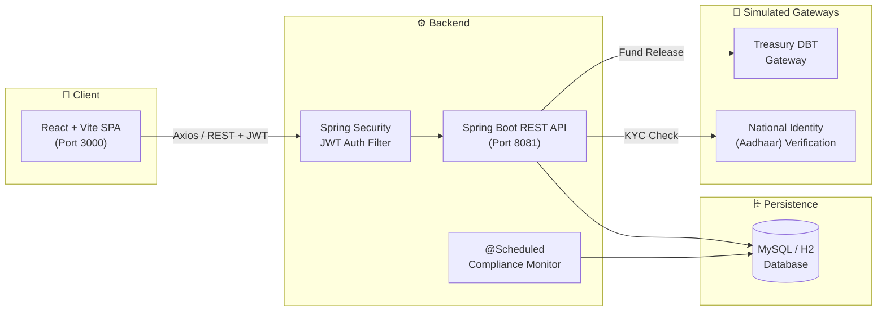
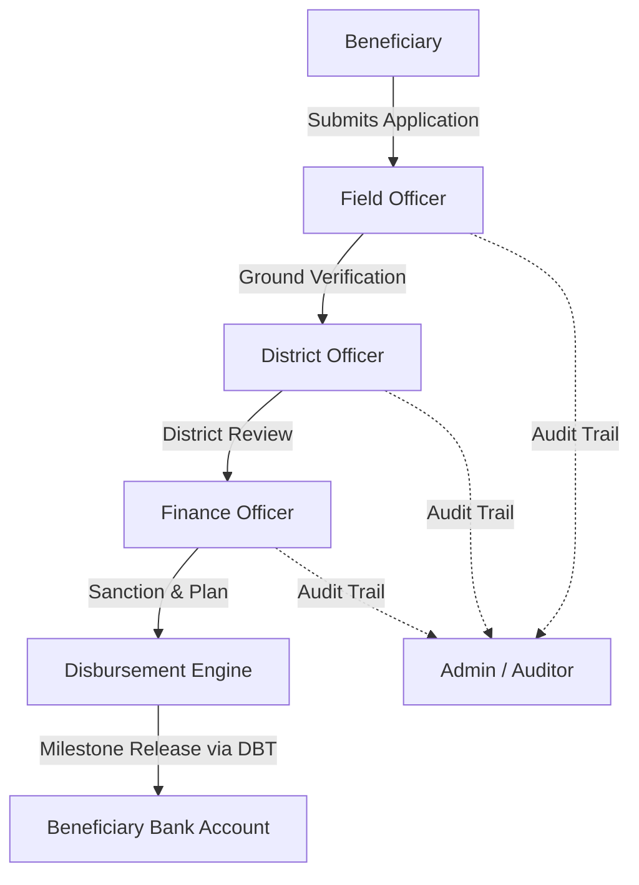
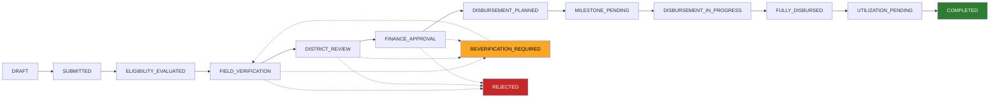

# 🏛️ Development of Digital Subsidy & Grant Administration Platform

**An enterprise-grade, full-stack e-Governance platform for managing the complete lifecycle of government subsidies and grants** — from application and eligibility scoring to multi-level verification, staged disbursement, milestone compliance, and fund utilization tracking.

`Java` `Spring Boot` `Spring Security` `Spring Data JPA` `MySQL` `React` `Vite` `JWT` `Swagger/OpenAPI`

---

## 📖 Table of Contents

1. [Overview](#-overview)
2. [Tech Stack](#-tech-stack)
3. [System Architecture](#-system-architecture)
4. [Core Modules](#-core-modules)
5. [Application Workflow](#-application-workflow)
6. [Seed Demo Accounts](#-seed-demo-accounts)
7. [Project Structure](#-project-structure)
8. [Getting Started](#-getting-started)
9. [Environment Configuration](#-environment-configuration)
10. [Database Schema](#-database-schema)
11. [API Reference](#-api-reference)
12. [Running Tests](#-running-tests)
13. [License](#-license)

---

## 🔎 Overview

This platform digitizes the end-to-end journey of a government subsidy — from a citizen's application, through automated eligibility scoring and a three-tier officer verification pipeline, to staged Direct Benefit Transfer (DBT) disbursement and final fund-utilization sign-off. It includes:

- **Automated eligibility scoring** based on income, age, social category, land holding, and KYC status
- **Multi-level verification** across Field, District, and Finance officers
- **Milestone-based disbursement** with compliance gating before funds are released
- **Treasury DBT simulation** issuing RBI/PFMS-style UTR transaction references
- **Immutable audit logging** of every lifecycle transition, suitable for CAG-style audits
- **Regional & scheme-level analytics** with exportable reports

The system is split into two deployable components:

| Component | Description |
| :--- | :--- |
| **Backend** | Spring Boot REST API, MySQL persistence, JWT auth, scheduled compliance jobs |
| **Frontend** | React + Vite single-page application consuming the backend API |

---

## 🛠️ Tech Stack

| Layer | Technology | Purpose |
| :--- | :--- | :--- |
| Backend Framework | Spring Boot | REST API architecture |
| Language | Java 17 / 21 | Core business logic |
| Security & Auth | Spring Security + JWT | Stateless authentication & role-based access control |
| Persistence / ORM | Hibernate / Spring Data JPA | Entity-relational mapping & repositories |
| Database | MySQL 8.x (or H2 for zero-setup) | Relational data store |
| API Documentation | Swagger / OpenAPI | Interactive endpoint playground |
| Frontend Framework | React + Vite | Single-page application |
| Routing | React Router v6 | Client-side navigation |
| HTTP Client | Axios | API communication |
| Icons | Lucide React | UI iconography |

---

## 🏗️ System Architecture



**Roles interact with the same backend through role-based JWT tokens:**



---

## 📦 Core Modules

### 1. Beneficiary & Scheme Master Data Management
- Beneficiary registration with Aadhaar identity validation, socio-economic category (`GENERAL`, `OBC`, `SC`, `ST`, `EWS`), KYC status, and bank/DBT details.
- Scheme creation with budget caps, grant slabs (`minGrantAmount` / `maxGrantAmount`), and configurable eligibility criteria.
- Regional budget allocation with allocation-vs-utilization tracking.

### 2. Eligibility Scoring & Multi-Level Verification
- Automated 0–100 scoring engine weighing age, income ratio, social category, landholding, and KYC.
- Decision thresholds: **≥ 70 → Eligible**, **50–69 → Borderline Review**, **< 50 → Ineligible**.
- Sequential 3-stage review pipeline: **Field Officer → District Officer → Finance Officer**.
- Rejection & re-verification routing, plus risk classification (`LOW`, `FLAGGED`, `HIGH_VALUE` for grants ≥ ₹5,00,000).

### 3. Staged Disbursement & Milestone Compliance
- Multi-milestone disbursement plans (e.g., 30% advance → 40% mid-stage → 30% final).
- Funds are held until compliance conditions for each milestone are inspected and satisfied.
- Treasury DBT gateway simulation generating RBI/PFMS-compliant UTR numbers.
- Scheduled sweeps automatically flag overdue milestones and unutilized funds.

### 4. Fund Utilization & Regional Analytics
- Tracks utilized funds against released funds (`utilizationPercentage = utilized / released × 100`).
- Ground expenditure proof upload with officer certification, advancing applications to `COMPLETED`.
- Executive KPI dashboards and CSV/PDF/Excel report exports.

### 5. Security, Integrations & Audit
- Stateless JWT authentication with BCrypt password hashing and `@PreAuthorize` method-level protection.
- Role-based access: `ROLE_BENEFICIARY`, `ROLE_FIELD_OFFICER`, `ROLE_DISTRICT_OFFICER`, `ROLE_FINANCE_OFFICER`, `ROLE_ADMIN`.
- Mock external gateways for Treasury DBT transfers and national identity (Aadhaar) verification.
- Immutable audit trail capturing timestamp, actor, role, entity, state transition, and remarks.

---

## 🔄 Application Workflow

Every application progresses through an 11-stage state machine, enforced identically on both backend and frontend:



Applications may also be routed to `REVERIFICATION_REQUIRED` (looping back for another review) or `REJECTED` at any of the three officer review stages.

---

## 👥 Seed Demo Accounts

Use these accounts to log in directly, or use the **1-Click Quick Demo Role Switcher** in the app header to instantly jump between roles.

| Role | Username | Password | Full Name | Primary Responsibilities |
| :--- | :--- | :--- | :--- | :--- |
| **Admin** | `admin` | `Admin@123` | Rajesh Sharma | Scheme master, criteria rules, regional budgets, audit logs, analytics |
| **Field Officer** | `field_officer1` | `Officer@123` | Amit Kumar | Physical inspection, ground verification, document verification |
| **District Officer** | `district_officer1` | `District@123` | Dr. Neha Verma | District scrutiny, administrative endorsement, overdue milestone monitoring |
| **Finance Officer** | `finance_officer1` | `Finance@123` | Sanjay Gupta | Financial sanctions, staged milestone plans, Treasury DBT fund releases |
| **Beneficiary 1** | `farmer_john` | `User@123` | John Doe | Browse schemes, apply for subsidies, track workflow, submit utilizations |
| **Beneficiary 2** | `artisan_priya` | `User@123` | Priya Patel | Apply for rural solar & artisan schemes, track disbursements |

---

## 🗂️ Project Structure

```
project-root/
├── backend/          # Spring Boot REST API
│   └── src/main/resources/application.properties
└── frontend/         # React + Vite SPA
    └── .env
```

---

## 🚀 Getting Started

### Prerequisites

| Requirement | Backend | Frontend |
| :--- | :--- | :--- |
| Runtime | Java 17 or 21 (LTS) | Node.js 18+ or 20+ |
| Build tool | Maven 3.9+ | npm 9+ or 11+ |
| Database | MySQL 8.x (or H2 for zero-setup) | — |

### 1. Run the Backend

```powershell
# From the backend directory
mvn spring-boot:run
```

Or run the pre-built executable JAR:

```powershell
java -jar target/government-subsidy-system-1.0.0.jar
```

For a zero-setup in-memory database, use the `h2` profile instead:

```powershell
java -jar target/government-subsidy-system-1.0.0.jar --spring.profiles.active=h2
```

The backend starts on **`http://localhost:8081`**.

### 2. Run the Frontend

```powershell
# Navigate to the frontend directory
cd frontend

# Install dependencies
npm install

# Start the local dev server
npm run dev

# Build for production
npm run build
```

The frontend runs on **`http://localhost:3000`** and communicates with the backend API.

### 3. Open the Application

- **Frontend SPA:** `http://localhost:3000/`
- **Embedded backend dashboard (if used standalone):** `http://localhost:8081/`

---

## ⚙️ Environment Configuration

### Backend — `application.properties`

```properties
spring.datasource.url=jdbc:mysql://localhost:3306/subsidy_db?useSSL=false&allowPublicKeyRetrieval=true&serverTimezone=UTC
spring.datasource.username=root
spring.datasource.password=root
```

> ⚠️ **Important:** `root` / `root` is a placeholder. Replace `spring.datasource.username` and `spring.datasource.password` with **your own MySQL credentials** — i.e. whatever username and password you configured for MySQL on your laptop. If you don't update this, the backend will fail to start with an `Access denied for user` error.

Create the database before first run:

```sql
CREATE DATABASE subsidy_db CHARACTER SET utf8mb4 COLLATE utf8mb4_unicode_ci;
```

### Frontend — `.env`

```ini
VITE_API_BASE_URL=http://localhost:8081
```

Update this if your backend runs on a different host or port.

---

## 🗄️ Database Schema

The system uses **14 normalized tables**:

| Table | Purpose |
| :--- | :--- |
| `users` | User credentials, email, phone, status |
| `roles` | Role definitions |
| `user_roles` | User–role join table |
| `regions` | Regional jurisdictions, allocated & utilized budgets |
| `beneficiaries` | Identity (Aadhaar), category, income, land holding, bank details, KYC status |
| `schemes` | Scheme code, department, budget, grant slabs, min score |
| `eligibility_criteria` | Rule types, operators, expected values, weights, mandatory flag |
| `subsidy_applications` | Application number, status, risk level, score, amounts |
| `application_documents` | Attached verification documents & metadata |
| `verifications` | Multi-stage verification records with remarks and decisions |
| `disbursement_plans` | Sanctioned plans tracking planned/released/remaining balances |
| `disbursement_milestones` | Sequenced milestones, amounts, due dates, compliance conditions |
| `fund_releases` | DBT records with UTR, payment mode, treasury status |
| `fund_utilizations` | Expenditure receipts, proof documents, verification records |
| `audit_logs` | Immutable audit trail of every lifecycle transition |

---

## 🔌 API Reference

| Module | Method & Path | Controller | Description |
| :--- | :--- | :--- | :--- |
| Auth | `POST /api/auth/login` | `AuthController` | JWT Bearer authentication |
| Auth | `POST /api/auth/register` | `AuthController` | New user/beneficiary registration |
| Auth | `GET /api/auth/me` | `AuthController` | Authenticated user profile |
| Schemes | `GET /api/schemes` | `SchemeController` | Public & authenticated scheme list |
| Schemes | `GET /api/schemes/active` | `SchemeController` | Active welfare programs |
| Schemes | `POST /api/schemes` | `SchemeController` | Admin scheme creation with criteria |
| Schemes | `PUT /api/schemes/{id}` | `SchemeController` | Update scheme budget and criteria |
| Beneficiaries | `GET /api/beneficiaries/me` | `BeneficiaryController` | Logged-in beneficiary profile |
| Beneficiaries | `POST /api/beneficiaries` | `BeneficiaryController` | Register identity & bank DBT details |
| Beneficiaries | `GET /api/beneficiaries` | `BeneficiaryController` | Beneficiary master directory |
| Beneficiaries | `PATCH /api/beneficiaries/{id}/kyc` | `BeneficiaryController` | KYC certification update |
| Applications | `POST /api/applications` | `ApplicationController` | Create draft application |
| Applications | `POST /api/applications/{id}/submit` | `ApplicationController` | Formally submit application |
| Applications | `POST /api/applications/{id}/documents` | `ApplicationController` | Attach verification documents |
| Applications | `POST /api/applications/{id}/evaluate-eligibility` | `ApplicationController` | Automated eligibility scoring |
| Applications | `GET /api/applications/my` | `ApplicationController` | Beneficiary application history |
| Applications | `GET /api/applications` | `ApplicationController` | Officer multi-status query |
| Applications | `GET /api/applications/{id}` | `ApplicationController` | Full application detail view |
| Verifications | `POST /api/verifications/field/{id}` | `VerificationController` | Ground field inspection |
| Verifications | `POST /api/verifications/district/{id}` | `VerificationController` | District magistrate review |
| Verifications | `POST /api/verifications/finance/{id}` | `VerificationController` | Finance sanction & grant earmarking |
| Verifications | `GET /api/verifications/application/{id}` | `VerificationController` | Verification stage audit history |
| Disbursements | `POST /api/disbursements/plan` | `DisbursementController` | Formulate staged milestone schedule |
| Disbursements | `GET /api/disbursements/application/{id}` | `DisbursementController` | Application disbursement plan |
| Disbursements | `POST /api/disbursements/milestones/{id}/release` | `DisbursementController` | Treasury DBT release with UTR |
| Milestones | `POST /api/milestones/{id}/complete` | `MilestoneController` | Mark compliance condition satisfied |
| Milestones | `GET /api/milestones/overdue` | `MilestoneController` | Overdue milestone monitor |
| Utilizations | `POST /api/utilizations/application/{id}` | `UtilizationController` | Submit ground expenditure invoices |
| Utilizations | `GET /api/utilizations/application/{id}` | `UtilizationController` | Application utilization list |
| Utilizations | `POST /api/utilizations/{id}/verify` | `UtilizationController` | Certify expenditure; advances to `COMPLETED` |
| Analytics | `GET /api/analytics/dashboard` | `AnalyticsController` | Executive KPI analytics |
| Reports | `GET /api/reports/.../csv` | `ReportController` | CSV export for Schemes, Regions, Disbursements, Milestones, Utilizations |
| Audit Logs | `GET /api/audit-logs` | `AuditController` | Immutable audit trail |
| Integrations | `POST /api/integrations/treasury/test-transfer` | `IntegrationController` | Treasury DBT transfer simulator |
| Integrations | `GET /api/integrations/beneficiary/verify-identity` | `IntegrationController` | National identity verification simulator |

> 💡 Full interactive API documentation is available via Swagger/OpenAPI once the backend is running.

---

## 🧪 Running Tests

```powershell
mvn test
```

All backend unit and integration tests cover authentication, eligibility evaluation, the workflow state machine, staged disbursement, milestone compliance, and fund utilization.

---

## 📄 License

This project is licensed under the **MIT License**.
